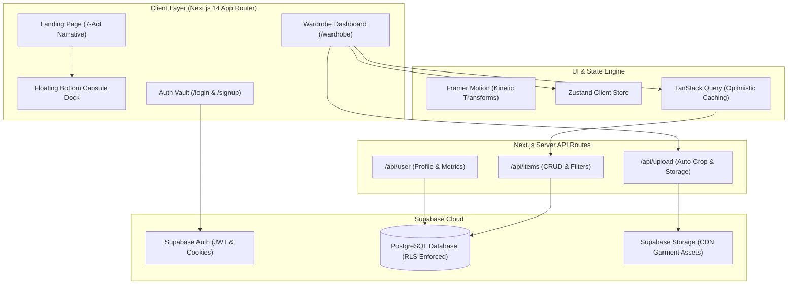

<div align="center">

  

  # 🏷️ TAG — Wardrobe Intelligence System
  
  <p align="center">
    <strong>Tag every piece. Know what you own. Wear more of it.</strong>
  </p>
  
  <p align="center">
    A brutalist, high-performance wardrobe inventory and conscious consumption platform.<br />
    Digitize your closet, break fast-fashion impulse loops, and track real-time Cost-Per-Wear (CPW).
  </p>

  <p align="center">
    <a href="#-key-features">Features</a> •
    <a href="#-the-wardrobe-paradox">The Vision</a> •
    <a href="#-tech-stack">Tech Stack</a> •
    <a href="#-system-architecture">Architecture</a> •
    <a href="#-getting-started">Getting Started</a> •
    <a href="#-roadmap">Roadmap</a>
  </p>

  <p align="center">
    
    
    
    
    
    
  </p>

</div>

---

## 🔮 The Wardrobe Paradox

> [!IMPORTANT]
> **We own more clothes than ever, yet wear less of them than ever.**
> Fast fashion and fragmented closets condition us into a toxic cycle: buy on impulse, bury in back drawers, forget, and repeat purchases.

```
       ┌────────────────────────────────────────────────────────┐
       │               THE CLOSET IMPULSE LOOP                  │
       └──────────────────────────┬─────────────────────────────┘
                                  │
                                  ▼
                    ┌───────────────────────────┐
                    │     Impulse Purchase      │ 💸
                    └─────────────┬─────────────┘
                                  │
                                  ▼
                    ┌───────────────────────────┐
                    │   Buried in Deep Drawer   │ 📦
                    └─────────────┬─────────────┘
                                  │
                                  ▼
                    ┌───────────────────────────┐
                    │    Invisibility Effect    │ 👁️
                    └─────────────┬─────────────┘
                                  │
                                  ▼
                    ┌───────────────────────────┐
                    │ "I Have Nothing to Wear!" │ 🌀
                    └─────────────┬─────────────┘
                                  │
                                  ▼
                    ┌───────────────────────────┐
                    │   Accidental Duplicate    │ 🔁
                    └─────────────┬─────────────┘
                                  │
                                  └────────► (Cycle Repeats)
```

### The Hard Numbers Behind the Chaos

| Metric | Industry Average | With TAG Intelligence |
| :--- | :--- | :--- |
| **Unworn Garments** | **73%** sit untouched >12 months | **< 22%** dormant inventory |
| **Closet Ratio** | **80%** of daily outfits use **20%** of closet | **75%+** active rotation rate |
| **Morning Decision Time** | **12 minutes** staring into racks | **< 45 seconds** digital outfit lookup |
| **Duplicate Spend** | **$1,200 / year** on repeat buys | **$0** accidental ghost purchases |

---

## ✨ Key Features

###  1. Sub-Pixel Background Erase & Auto-Crop
- Snap any garment directly on your bed, carpet, or hanger.
- Automated AI segmentation strips out background clutter and extracts the clean silhouette into a crisp, high-resolution transparent PNG.
- Automatically detects dominant hues, fabric weight, and silhouette lines.

###  2. Six Canonical Taxonomies
Strictly maps your physical wardrobe into 6 database-enforced pillars:
- **`tops`** — T-shirts, knitwear, collared shirts, hoodies, base layers.
- **`bottoms`** — Tailored trousers, raw denim, cargo shorts, skirts.
- **`dresses`** — One-piece silhouettes, slip dresses, evening gowns.
- **`outerwear`** — Wool overcoats, blazers, trench coats, technical shells.
- **`shoes`** — Chunky loafers, vintage runners, leather boots, formal derbies.
- **`accessories`** — Bags, eyewear, leather belts, jewelry, scarves.

###  3. Cost-Per-Wear (CPW) Telemetry
- Treat clothing like an investment asset, not disposable waste.
- Real-time CPW formula: $\text{Cost-Per-Wear} = \frac{\text{Purchase Price}}{\text{Logged Wears}}$
- Log outfits in one click. Watch a $150 designer overcoat drop from **$75.00** after 2 wears down to **$3.75** after 40 wears.
- Gamified re-wear milestones reward conscious long-term fashion habits.

###  4. Capsule Curation & Rotation Engine
- Assemble outfits digitally without pulling hangers off the rail or dumping clothes onto your bed.
- Filter combinations by weather, formality, color harmony, and season.
- Curate and save travel packing capsules, workweek rotations, and weekend uniforms.

###  5. PatternBreak-Inspired Glassmorphic UX
- **7-Act Narrative Flow**: Guides the user through the psychology of overconsumption into digital clarity.
- **Dual Video Showcase**: Incorporates `/hero-chaos.mp4` inside an iPhone frame and `/hero-order.mp4` with real-time laser scan telemetry.
- **Sticky Stacking Drawers**: Interactive layered feature cards that stack smoothly on scroll.
- **Floating Bottom Capsule Dock**: Fixed bottom-center capsule with active spring pill indicator that tracks viewport sections.

###  6. Private & Secure Supabase Vault
- Zero data mining. Your wardrobe photos and metrics are secured with Row Level Security (RLS).
- Fast edge image delivery with automated thumbnail and metadata caching.

---

## 🛠️ Tech Stack

| Domain | Technology | Description |
| :--- | :--- | :--- |
| **Framework** | [Next.js 14](https://nextjs.org/) | App Router, Server Components, Route Handlers, Edge Runtime |
| **Language** | [TypeScript 5](https://www.typescriptlang.org/) | Strict type safety, zero `any` declarations |
| **Styling** | [Tailwind CSS 3.4](https://tailwindcss.com/) | Custom design tokens, glassmorphism, hairline grid overlays |
| **Motion & Dynamics** | [Framer Motion 13](https://www.framer.com/motion/) | Scroll-driven transforms, layout spring physics, kinetic typography |
| **3D & Canvas** | [Three.js](https://threejs.org/) / [R3F](https://r3f.docs.pmnd.rs/) | 3D garment tag interactions & shader gradients |
| **Database & Auth** | [Supabase](https://supabase.com/) | PostgreSQL, Auth, Row-Level Security (RLS), Edge Storage |
| **State & Cache** | [Zustand](https://zustand-demo.pmnd.rs/) & [TanStack Query](https://tanstack.com/query) | Client store & optimistic server state management |
| **Form Validation** | [React Hook Form](https://react-hook-form.com/) + [Zod](https://zod.dev/) | Client & server schema validation |
| **Icons & Typography** | [Lucide React](https://lucide.dev/) + Google Fonts | Syne, Space Mono, IBM Plex Mono |

---

## 🏛️ System Architecture



---

## 🗄️ Database Schema & Taxonomy Constraints

```sql
-- Core Garment Item Model
create table public.items (
  id uuid primary key default gen_random_uuid(),
  user_id uuid references auth.users(id) on delete cascade not null,
  name text not null,
  category text not null check (category in ('tops', 'bottoms', 'dresses', 'outerwear', 'shoes', 'accessories')),
  brand text,
  color text,
  size text,
  season text[] default '{}',
  image_url text not null,
  purchase_price numeric(10, 2) default 0.00,
  wear_count integer default 0,
  last_worn_at timestamp with time zone,
  created_at timestamp with time zone default now() not null
);

-- Row Level Security
alter table public.items enable row level security;

create policy "Users can only read and manage their own wardrobe items"
  on public.items for all
  using (auth.uid() = user_id);
```

> [!NOTE]
> In accordance with project schema standards, footwear is strictly registered under **`shoes`** (never `footwear`).

---

## 📂 Project Structure

```
tag-wardrobe/
├── public/                         # Static production assets
│   ├── favicon.svg                 # Application favicon
│   ├── hero-chaos.mp4              # Act 1 Chaos wardrobe video (~6.1 MB)
│   ├── hero-order.mp4              # Act 4 Transformation order video (~3.9 MB)
│   └── tag-logo.png                # Brand identity logo
├── src/
│   ├── app/                        # Next.js 14 App Router
│   │   ├── api/                    # Serverless API routes
│   │   │   ├── auth/               # Supabase signout & session handlers
│   │   │   ├── items/              # Wardrobe items CRUD
│   │   │   ├── upload/             # Image upload & auto-crop endpoint
│   │   │   └── user/               # User preferences & telemetry
│   │   ├── globals.css             # Global styles, patternbreak-grid, typography
│   │   ├── layout.tsx              # Root HTML layout, Syne/Mono font injection
│   │   ├── login/                  # User authentication login view
│   │   ├── page.tsx                # Master 7-Act Landing Page
│   │   ├── settings/               # Account & preferences view
│   │   ├── signup/                 # Registration view
│   │   └── wardrobe/               # Main inventory management dashboard
│   ├── components/
│   │   ├── landing/                # PatternBreak Landing Components
│   │   │   ├── category-spectrum.tsx   # Act 6: The Six Taxonomies
│   │   │   ├── cta.tsx                 # Act 7: Grand Finale CTA & Footer
│   │   │   ├── cursor.tsx              # Custom interactive cursor
│   │   │   ├── deceptive-patterns.tsx  # Act 3: Interactive Traps & Pattern Breakers
│   │   │   ├── floating-dock.tsx       # Signature Pinned Capsule Dock
│   │   │   ├── hero.tsx                # Act 1: Phone Mockup + Chaos Video + Badges
│   │   │   ├── kinetic-stats.tsx       # Act 2: High-contrast Dark Data Wall
│   │   │   ├── landing-nav.tsx         # Tone-aware glassmorphic navigation header
│   │   │   ├── stacking-system.tsx     # Act 5: Sticky Stacking Feature Drawers
│   │   │   └── transformation.tsx      # Act 4: Studio Stage + Order Video + HUD
│   │   ├── ui/                     # Primitives & shadcn design components
│   │   └── wardrobe/               # Dashboard drawers, filters, item cards
│   └── lib/                        # Utility functions & Supabase clients
├── SESSION_LOG.md                  # Comprehensive session history & technical logs
├── tailwind.config.ts              # Tailwind configuration & typography extensions
└── tsconfig.json                   # TypeScript compiler rules
```

---

## 🚀 Getting Started

### Prerequisites
- **Node.js**: `v18.17.0` or higher
- **npm** / **pnpm** / **yarn**
- A **[Supabase](https://supabase.com/)** project (for database & storage)

### 1. Clone the Repository
```bash
git clone https://github.com/RazeO1/Dress-up.git
cd Dress-up
```

### 2. Install Dependencies
```bash
npm install
```

### 3. Configure Environment Variables
Create a `.env.local` file in the root directory:
```env
NEXT_PUBLIC_SUPABASE_URL=https://your-project.supabase.co
NEXT_PUBLIC_SUPABASE_ANON_KEY=your-anon-key
SUPABASE_SERVICE_ROLE_KEY=your-service-role-key
```

### 4. Run the Development Server
```bash
npm run dev
```
Open [http://localhost:3000](http://localhost:3000) in your browser.

---

## 🧪 Verification & Scripts

```bash
# Run local development server
npm run dev

# Run TypeScript typecheck without emitting files
npx tsc --noEmit

# Run Next.js ESLint verification
npm run lint

# Build production bundle
npm run build

# Start production server
npm run start
```

---

## 🗺️ Roadmap

- [x] **Phase 1: Architecture & Bug Bashes**
  - [x] Clean Next.js 14 cache artifacts & hydration fixes
  - [x] Tone-aware dynamic navbar detection
  - [x] Restore native I-beam cursor inside form inputs
- [x] **Phase 2: PatternBreak Landing Page Overhaul**
  - [x] 7-Act narrative storytelling sequence
  - [x] Integration of `/hero-chaos.mp4` and `/hero-order.mp4`
  - [x] Kinetic data wall & interactive deceptive pattern breaker
  - [x] Scroll-driven sticky stacking card drawers
  - [x] Pinned floating bottom capsule dock with active spring highlight
- [ ] **Phase 3: Auth & Onboarding Redesign (Upcoming)**
  - [ ] Glassmorphic brutalist redesign for `/login` and `/signup`
  - [ ] Interactive wardrobe onboarding questionnaire
- [ ] **Phase 4: Advanced Wardrobe Intelligence**
  - [ ] AI automatic weather-based outfit generator
  - [ ] PDF & image capsule export for vacation packing

---

## 📄 License

Distributed under the **MIT License**. See `LICENSE` for more information.

---

<div align="center">
  <p>Built with precision for conscious fashion curators.</p>
  <p><strong>TAG © 2026 — Know what you own. Wear more of it.</strong></p>
</div>
